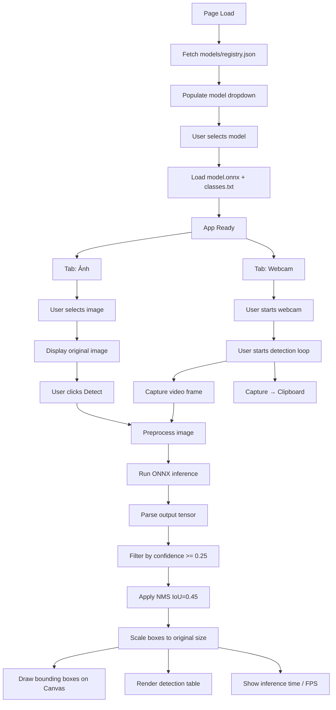

# Design Document: YOLO Image Detection

## Overview

Static web app chạy hoàn toàn trên trình duyệt, thực hiện object detection bằng model YOLO tùy chỉnh thông qua ONNX Runtime Web. App hỗ trợ nhiều model — người dùng chọn model từ dropdown, sau đó chọn ảnh và chạy inference. Kết quả hiển thị gồm ảnh có bounding box và bảng thống kê.

Không có backend — toàn bộ logic chạy trong browser. Danh sách model được đọc từ `models/registry.json`; mỗi model nằm trong subfolder riêng dưới `models/`.

**Tech stack:**
- HTML + CSS + JavaScript (single file)
- ONNX Runtime Web (`ort.js`) qua CDN
- HTML5 Canvas API để vẽ bounding box

**Cấu trúc thư mục models:**
```
models/
├── registry.json          # Danh sách model
└── candy/
    ├── model.onnx
    └── classes.txt
```

---

## Architecture



**Luồng dữ liệu chính:**
1. `registry.json` → populate dropdown → user chọn model
2. `model.onnx` → `ort.InferenceSession` → tensor inference
3. Raw output `[1, 4+N, 8400]` → parse → filter → NMS → scaled detections
4. Scaled detections → Canvas draw + table render

---

## Components and Interfaces

### ModelRegistry

Fetch và parse `models/registry.json`, populate dropdown.

```js
// Fetch danh sách model từ registry
async function loadRegistry(registryPath: string): Promise<ModelEntry[]>

interface ModelEntry {
  id: string;        // e.g. "candy"
  name: string;      // e.g. "Candy Detection"
  modelPath: string; // e.g. "models/candy/model.onnx"
  classesPath: string; // e.g. "models/candy/classes.txt"
}
```

### ModelLoader

Chịu trách nhiệm load model và class list khi người dùng chọn model.

```js
// Khởi tạo ONNX session
async function loadModel(modelPath: string): Promise<ort.InferenceSession>

// Load danh sách class
async function loadClasses(classesPath: string): Promise<string[]>
```

### ImagePreprocessor

Tiền xử lý ảnh đầu vào về tensor 640×640 với letterbox padding.

```js
// Resize + pad ảnh về 640x640, trả về Float32Array tensor và scale info
function preprocessImage(imageElement: HTMLImageElement): {
  tensor: Float32Array,   // shape [1, 3, 640, 640], normalized [0,1]
  scaleX: number,         // tỉ lệ scale theo chiều ngang
  scaleY: number,         // tỉ lệ scale theo chiều dọc
  padX: number,           // padding trái (px trong không gian 640)
  padY: number            // padding trên (px trong không gian 640)
}
```

### Detector

Chạy inference và xử lý output tensor.

```js
// Chạy inference, trả về danh sách detection sau NMS
async function runDetection(
  session: ort.InferenceSession,
  tensor: Float32Array,
  classes: string[],
  confidenceThreshold: number,  // 0.25
  iouThreshold: number          // 0.45
): Promise<Detection[]>
```

### NMS (Non-Maximum Suppression)

```js
// Lọc bounding box trùng lặp
function applyNMS(detections: Detection[], iouThreshold: number): Detection[]

// Tính IoU giữa 2 box
function computeIoU(boxA: BoundingBox, boxB: BoundingBox): number
```

### Renderer

Vẽ bounding box lên canvas và render bảng thống kê.

```js
// Vẽ tất cả detection lên canvas
function drawDetections(
  canvas: HTMLCanvasElement,
  image: HTMLImageElement,
  detections: Detection[],
  classColors: Map<string, string>
): void

// Render bảng thống kê
function renderTable(detections: Detection[]): void
```

### UIController

Quản lý trạng thái UI (loading, ready, processing, error) và model dropdown.

```js
function setStatus(state: 'loading' | 'ready' | 'processing' | 'error', message?: string): void
function clearResults(): void
function populateModelDropdown(models: ModelEntry[]): void
```

### Magnifier

Kính lúp hình tròn hiển thị vùng canvas được phóng to theo vị trí chuột.

```js
// Khởi tạo magnifier — gắn event listeners vào các canvas targets
function initMagnifier(targetCanvasIds: string[]): void

// Vẽ vùng phóng to vào magnifier canvas
// srcCanvas: canvas nguồn, mouseX/Y: vị trí chuột trong viewport
// zoomLevel: hệ số phóng to (1–5), lensSize: đường kính lens (px)
function renderMagnifier(srcCanvas, mouseX, mouseY, zoomLevel, lensSize): void
```

**Thông số kỹ thuật:**
- Lens size: 100–300 px (mặc định 180px), điều chỉnh qua slider
- Zoom range: ×1 – ×5, bước 0.5
- Offset so với con trỏ: 8px (tự đảo chiều nếu gần mép viewport)
- Source sampling: tính đúng tỉ lệ CSS pixel vs canvas logical pixel

### WebcamController

Quản lý vòng đời webcam và real-time detection loop.

```js
async function startWebcam(): Promise<void>          // Yêu cầu quyền camera, hiển thị video
function toggleWebcamDetection(): void               // Bắt đầu/tạm dừng inference loop
function stopWebcam(): void                          // Dừng stream, giải phóng camera
async function captureToClipboard(): Promise<void>   // Copy result canvas → clipboard PNG
```

**Real-time loop:** Dùng `requestAnimationFrame` để chạy inference liên tục. Mỗi frame:
1. Vẽ video frame lên `original-canvas`
2. `preprocessFromCanvas(origCanvas)` → tensor
3. `runDetection(...)` → detections
4. Vẽ bounding box lên `result-canvas`
5. Cập nhật timing + FPS

### TimingDisplay

Hiển thị thời gian inference và FPS.

```js
function showTiming(ms: number, fps?: number): void
```

- Inference time: hiển thị sau mỗi lần detect (cả image và webcam)
- FPS: chỉ hiển thị khi webcam đang chạy, cập nhật mỗi 500ms

---

## Data Models

### Detection

```ts
interface Detection {
  classIndex: number;       // index trong class list
  className: string;        // tên class (e.g. "100 Yen")
  confidence: number;       // 0.0 – 1.0
  box: BoundingBox;         // tọa độ trong không gian ảnh gốc
}
```

### BoundingBox

```ts
interface BoundingBox {
  x: number;      // tọa độ trái (px)
  y: number;      // tọa độ trên (px)
  width: number;  // chiều rộng (px)
  height: number; // chiều cao (px)
}
```

### PreprocessResult

```ts
interface PreprocessResult {
  tensor: Float32Array;  // [1, 3, 640, 640] normalized
  scaleX: number;
  scaleY: number;
  padX: number;
  padY: number;
}
```

### ClassStats (cho bảng thống kê)

```ts
interface ClassStats {
  className: string;
  count: number;
  avgConfidence: number;  // 0.0 – 1.0, hiển thị dạng %
}
```

### YOLO Output Format

Model YOLO xuất tensor shape `[1, 4+N, 8400]` (N = số class):
- Dimension 1: batch size = 1
- Dimension 2: 4 (cx, cy, w, h) + N class scores
- Dimension 3: 8400 anchor predictions

Parse logic: với mỗi anchor `i` trong 8400:
```
cx = output[0 * 8400 + i]
cy = output[1 * 8400 + i]
w  = output[2 * 8400 + i]
h  = output[3 * 8400 + i]
classScores = output[4...(4+N-1) * 8400 + i]
confidence = max(classScores)
classIndex = argmax(classScores)
```

Tọa độ box trong không gian 640×640, cần scale về ảnh gốc:
```
x_orig = (cx - w/2 - padX) / scaleX
y_orig = (cy - h/2 - padY) / scaleY
w_orig = w / scaleX
h_orig = h / scaleY
```

### Class Colors

Màu được gán động theo class index dùng HSL với bước hue = `360 / numClasses`. Với N class:

```js
function getClassColor(classIndex, numClasses) {
  const hue = Math.round((classIndex / numClasses) * 360);
  return `hsl(${hue}, 80%, 55%)`;
}
```


---

## Correctness Properties

*A property is a characteristic or behavior that should hold true across all valid executions of a system — essentially, a formal statement about what the system should do. Properties serve as the bridge between human-readable specifications and machine-verifiable correctness guarantees.*

**Property Reflection:** Sau khi phân tích prework, các property được hợp nhất để loại bỏ redundancy:
- 4.2 (class color) và 4.3 (label format) gộp thành một property về "detection rendering completeness".
- 5.3 (avg confidence calculation) và 5.4 (percentage format) gộp thành một property về "confidence display".
- 5.2 (table columns) và 5.5 (sort order) gộp thành một property về "table correctness".
- 4.1 và 4.5 gộp thành một property về "box rendering accuracy".

---

### Property 1: File format validation

*For any* file MIME type, the app SHALL accept the file if and only if its type is one of `image/png`, `image/jpeg`, or `image/webp`. Any other MIME type must be rejected with an error message.

**Validates: Requirements 2.2, 2.3**

---

### Property 2: Preprocessing output shape and normalization

*For any* input image with arbitrary width and height (>= 1px), the `preprocessImage` function SHALL return a Float32Array tensor of exactly `1 x 3 x 640 x 640 = 1,228,800` elements, with all values in the range `[0.0, 1.0]`.

**Validates: Requirements 3.2**

---

### Property 3: Confidence threshold filtering

*For any* list of raw detections with arbitrary confidence scores, after applying the confidence filter with threshold 0.25, every detection in the output SHALL have `confidence >= 0.25`, and no detection with `confidence < 0.25` SHALL appear in the output.

**Validates: Requirements 3.5**

---

### Property 4: NMS removes high-overlap boxes

*For any* list of detections after NMS with IoU threshold 0.45, no two remaining boxes of the same class SHALL have an IoU greater than 0.45. The box with the highest confidence in each overlapping group SHALL be retained.

**Validates: Requirements 3.4**

---

### Property 5: Bounding box coordinate scaling

*For any* original image dimensions `(W, H)` and any bounding box in 640x640 space with valid `scaleX`, `scaleY`, `padX`, `padY`, the scaled coordinates SHALL map the box back to the correct position in the original image space. Specifically, a box at the center of the 640x640 space SHALL map to the center of the original image.

**Validates: Requirements 4.5**

---

### Property 6: Detection rendering completeness

*For any* list of N detections, each detection SHALL be rendered on the canvas with: (a) a bounding box in the color corresponding to its class index, and (b) a label string containing the class name and confidence score rounded to 2 decimal places.

**Validates: Requirements 4.1, 4.2, 4.3**

---

### Property 7: Results cleared on new image selection

*For any* sequence of image selections, after selecting a new image, no detection results (bounding boxes, table rows) from the previous inference SHALL remain visible on the UI.

**Validates: Requirements 2.5**

---

### Property 8: Detection table correctness

*For any* non-empty list of detections, the rendered table SHALL: (a) contain columns for class name, count, and average confidence; (b) display average confidence as a percentage string (e.g. "87.5%"); and (c) have rows sorted by count in descending order.

**Validates: Requirements 5.2, 5.3, 5.4, 5.5**

---

## Error Handling

| Scenario | Behavior |
|----------|----------|
| `models/registry.json` không tồn tại hoặc parse thất bại | Hiển thị error message, disable toàn bộ UI |
| `model.onnx` không tồn tại hoặc load thất bại | Hiển thị error message, disable nút Detect |
| `classes.txt` không tồn tại hoặc parse thất bại | Hiển thị error message, disable nút Detect |
| File ảnh không đúng định dạng | Hiển thị thông báo lỗi định dạng, không load ảnh |
| Inference throw exception | Hiển thị error message, re-enable nút Detect |
| Không phát hiện đối tượng nào (sau NMS + filter) | Hiển thị "Không phát hiện đối tượng nào", ẩn table |
| Canvas API không khả dụng | Hiển thị thông báo browser không hỗ trợ |
| Magnifier di chuyển ra ngoài viewport | Tự đảo vị trí lens sang phía đối diện con trỏ |
| Quyền truy cập camera bị từ chối | Hiển thị error message rõ ràng |
| Clipboard API không khả dụng hoặc bị từ chối | Hiển thị error message |

**Error display strategy:** Tất cả lỗi hiển thị trong một `#status` element với màu đỏ. Lỗi nghiêm trọng (model load fail) disable toàn bộ UI. Lỗi nhẹ (no detections) chỉ hiển thị thông báo.

---

## Testing Strategy

### Approach

Feature này là một static web app với logic xử lý ảnh và inference. PBT phù hợp cho các pure function (preprocessing, NMS, filtering, coordinate scaling, table aggregation). Integration test dùng cho ONNX Runtime.

**Testing library:** [fast-check](https://github.com/dubzzz/fast-check) cho property-based testing trong JavaScript.

### Unit Tests (Example-based)

Các trường hợp cụ thể cần cover:

- Model load thành công: status "ready" hiển thị
- Model load thất bại: error message hiển thị, Detect button disabled
- Chọn file PNG/JPG/JPEG/WEBP: ảnh hiển thị
- Chọn file .txt hoặc .pdf: error message hiển thị
- Inference đang chạy: button disabled, loading state
- Empty detection list: table ẩn, "no objects" message hiển thị
- Detection table: visible sau khi có kết quả

### Property-Based Tests

Mỗi property test chạy tối thiểu 100 iterations. Tag format: `Feature: yolo-image-detection, Property N: <property_text>`

**Property 1 — File format validation:**
Generate random MIME type strings. Verify: accepted iff type in `['image/png', 'image/jpeg', 'image/webp']`.

**Property 2 — Preprocessing output shape:**
Generate random image dimensions (1–4000px). Verify: output tensor length = 1,228,800 và mọi giá trị trong [0, 1].

**Property 3 — Confidence threshold filtering:**
Generate random detection lists với confidence scores [0, 1]. Verify: output chỉ chứa detections có confidence >= 0.25.

**Property 4 — NMS removes high-overlap boxes:**
Generate random sets of overlapping boxes. Verify: sau NMS, không có cặp box nào cùng class có IoU > 0.45.

**Property 5 — Bounding box coordinate scaling:**
Generate random image sizes và box coordinates trong 640x640 space. Verify: scaled coordinates nằm trong bounds của ảnh gốc và mapping chính xác.

**Property 6 — Detection rendering completeness:**
Generate random detection lists. Verify: mỗi detection có label chứa class name và confidence rounded đúng 2 decimal places.

**Property 7 — Results cleared on new image selection:**
Generate random sequences of image selections. Verify: sau mỗi lần chọn ảnh mới, previous results không còn trong DOM.

**Property 8 — Detection table correctness:**
Generate random detection lists với nhiều classes. Verify: table rows sorted by count descending, avg confidence hiển thị đúng dạng percentage.

### Integration Tests

- Load `models/model.onnx` thực tế và chạy inference với ảnh test: verify output tensor shape `[1, 14, 8400]`
- End-to-end: chọn ảnh -> detect -> verify canvas có bounding boxes và table có rows

---

## AWS Infrastructure Design

### Tổng quan kiến trúc

Static web app (HTML + models) được host trên **Amazon S3** và phân phối qua **Amazon CloudFront**. Không cần server backend — CloudFront đóng vai trò CDN, cung cấp HTTPS, cache, và CORS.

```mermaid
flowchart LR
    User([Người dùng]) -->|HTTPS| CF[CloudFront Distribution]
    CF -->|Cache hit| CF
    CF -->|Cache miss| S3[S3 Bucket\nyolo-app-static]
    S3 --> CF

    subgraph S3 Bucket
        idx[index.html]
        onnx[models/model.onnx]
        cls[models/classes.txt]
    end

    subgraph CloudFront
        B1[Default behavior\nindex.html, classes.txt\nCache: short TTL]
        B2[/models/*.onnx behavior\nCache: long TTL]
    end
```

### Tổ chức file trên S3

```
s3://yolo-app-static/
├── index.html              # Single-page app
└── models/
    ├── model.onnx          # Model YOLOv12 (~có thể > 50MB)
    └── classes.txt         # Danh sách 10 class
```

S3 bucket được cấu hình:
- **Block all public access**: bật (không expose S3 trực tiếp)
- **Bucket policy**: chỉ cho phép CloudFront OAC (Origin Access Control) đọc
- **Versioning**: bật để rollback khi cần

### CloudFront Distribution

**Origin:** S3 bucket với Origin Access Control (OAC) — thay thế OAI cũ.

**Cache Behaviors:**

| Path Pattern | TTL | Ghi chú |
|---|---|---|
| `models/*.onnx` | min: 86400s, default: 604800s (7 ngày) | Model ít thay đổi, cache dài để giảm transfer cost |
| `models/classes.txt` | min: 3600s, default: 86400s (1 ngày) | Thay đổi khi retrain |
| `*` (default) | min: 0s, default: 3600s (1 giờ) | `index.html` |

**HTTPS & Security:**
- Redirect HTTP → HTTPS
- TLS minimum: TLSv1.2
- Security headers qua CloudFront Response Headers Policy:
  - `X-Content-Type-Options: nosniff`
  - `X-Frame-Options: DENY`
  - `Strict-Transport-Security: max-age=31536000`

**CORS:**
Vì app là single-origin (HTML và models cùng domain CloudFront), CORS không bắt buộc. Tuy nhiên nếu cần gọi từ domain khác, thêm CORS policy trên S3 bucket:

```json
[{
  "AllowedOrigins": ["https://your-domain.com"],
  "AllowedMethods": ["GET"],
  "AllowedHeaders": ["*"],
  "MaxAgeSeconds": 86400
}]
```

**Custom Domain (tùy chọn):**
- Tạo certificate trên ACM (us-east-1) → gắn vào CloudFront
- Tạo CNAME record trên Route 53 trỏ về CloudFront domain

### Deployment Flow

**Manual deploy (đơn giản nhất):**

```bash
# Upload toàn bộ app
aws s3 sync . s3://yolo-app-static/ --exclude ".git/*" --exclude ".kiro/*"

# Invalidate cache sau khi update index.html
aws cloudfront create-invalidation \
  --distribution-id EXXXXXXXXX \
  --paths "/index.html" "/models/classes.txt"

# Không cần invalidate model.onnx nếu dùng versioned filename
```

**CI/CD với GitHub Actions (khuyến nghị khi có pipeline):**

```yaml
# .github/workflows/deploy.yml
name: Deploy to S3 + CloudFront
on:
  push:
    branches: [main]

jobs:
  deploy:
    runs-on: ubuntu-latest
    steps:
      - uses: actions/checkout@v4

      - name: Upload to S3
        run: |
          aws s3 sync . s3://${{ secrets.S3_BUCKET }}/ \
            --exclude ".git/*" --exclude ".github/*" --exclude ".kiro/*" \
            --cache-control "max-age=3600" \
            --exclude "models/*.onnx"

          # Upload model với cache-control dài hơn
          aws s3 cp models/model.onnx s3://${{ secrets.S3_BUCKET }}/models/model.onnx \
            --cache-control "max-age=604800"
        env:
          AWS_ACCESS_KEY_ID: ${{ secrets.AWS_ACCESS_KEY_ID }}
          AWS_SECRET_ACCESS_KEY: ${{ secrets.AWS_SECRET_ACCESS_KEY }}
          AWS_DEFAULT_REGION: ap-northeast-1

      - name: Invalidate CloudFront
        run: |
          aws cloudfront create-invalidation \
            --distribution-id ${{ secrets.CF_DISTRIBUTION_ID }} \
            --paths "/index.html" "/models/classes.txt"
        env:
          AWS_ACCESS_KEY_ID: ${{ secrets.AWS_ACCESS_KEY_ID }}
          AWS_SECRET_ACCESS_KEY: ${{ secrets.AWS_SECRET_ACCESS_KEY }}
```

> Lưu ý: `model.onnx` không bị invalidate mỗi lần deploy. Nếu model thay đổi, dùng versioned filename (e.g. `model-v2.onnx`) và cập nhật reference trong `index.html`.

### Chi phí ước tính

Giả sử traffic nhỏ (internal/demo app):

| Dịch vụ | Chi phí ước tính |
|---|---|
| S3 storage | ~$0.023/GB/tháng. Model 50MB + HTML ≈ $0.002/tháng |
| S3 GET requests | $0.0004/1000 requests — không đáng kể |
| CloudFront data transfer | 1TB đầu miễn phí/tháng (Free Tier). Sau đó ~$0.085/GB |
| CloudFront HTTPS requests | $0.0100/10,000 requests |

**Tổng ước tính:** < $1/tháng cho app nội bộ với vài chục người dùng.

### Lưu ý về model file size

`model.onnx` có thể lớn (30–100MB tùy kiến trúc YOLOv12). Một số điểm cần lưu ý:

- **S3 multipart upload:** Với file > 100MB, dùng `aws s3 cp` với `--multipart-threshold` hoặc `aws s3api create-multipart-upload`.
- **CloudFront cache:** TTL dài (7 ngày) giúp người dùng quay lại không cần tải lại model. File được cache tại edge location gần nhất.
- **Compression:** ONNX là binary format, không nên bật gzip/brotli compression cho file này (không giảm được nhiều, lại tốn CPU). Tắt compression cho `*.onnx` trong CloudFront.
- **Versioning model:** Khi retrain và deploy model mới, đổi tên file (e.g. `model-v2.onnx`) thay vì overwrite để tránh cache stale trên client.
- **Transfer Acceleration (tùy chọn):** Nếu người dùng ở xa region S3, bật S3 Transfer Acceleration để tăng tốc upload từ CI/CD pipeline.
